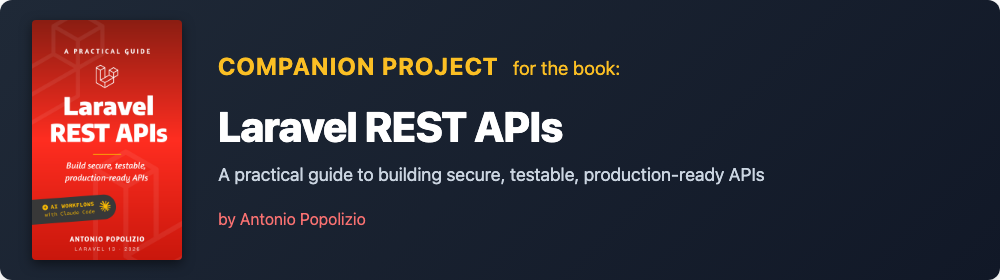

# BookShelf API



> ⚠️ This is a **learning project**, not a standalone application. The code is meant to be built step by step, following the chapters of the book. Each chapter adds a feature, from an empty Laravel project all the way to a fully tested, documented and deploy-ready REST API.

## Want to write a review?

If the book helped you, leaving a review on Amazon makes a huge difference for an indie author. Even two lines.

- 🇬🇧 [Leave a review (English edition)](https://antonio.popolizio.it/laravel-rest-apis/review)
- 🇮🇹 [Lascia una recensione (edizione italiana)](https://antonio.popolizio.it/api-rest-laravel/review)

## Stack

- PHP 8.3+ / Laravel 13
- SQLite (development)
- Sanctum (token authentication)
- Pest (testing)
- Scribe (API documentation)
- Envoy (deploy)

## Entities

- **Book** — title, ISBN, description, publication year, language, cover image
- **Author** — one author, many books
- **Publisher** — one publisher, many books
- **Genre** — many-to-many with books
- **User** — authenticated via Sanctum tokens
- **Review** — rating and comment on a book, with edit time window

## Endpoints

**Public:**

| Method | Endpoint | Description |
|--------|----------|-------------|
| GET | /api/books | List books (filter, sort, paginate) |
| GET | /api/books/{book} | Get a book |
| GET | /api/books/{book}/reviews | List reviews for a book |
| GET | /api/books/{book}/reviews/{review} | Get a review |
| GET | /api/authors | List authors |
| GET | /api/authors/{author} | Get an author |
| GET | /api/authors/{author}/books | List books by author |
| GET | /api/publishers | List publishers |
| GET | /api/publishers/{publisher} | Get a publisher |
| GET | /api/genres | List genres |
| POST | /api/auth/register | Register |
| POST | /api/auth/login | Login |

**Authenticated:**

| Method | Endpoint | Description |
|--------|----------|-------------|
| POST | /api/auth/logout | Logout (current token) |
| POST | /api/auth/logout/all | Logout (all tokens) |
| GET | /api/auth/me | Current user |
| POST | /api/books | Create a book |
| PUT | /api/books/{book} | Update a book (owner only) |
| DELETE | /api/books/{book} | Delete a book (owner only) |
| POST | /api/books/{book}/cover | Upload cover |
| DELETE | /api/books/{book}/cover | Delete cover |
| POST | /api/books/{book}/reviews | Create a review |
| PUT | /api/books/{book}/reviews/{review} | Update a review (owner, time-limited) |
| DELETE | /api/books/{book}/reviews/{review} | Delete a review (owner, time-limited) |
| POST | /api/authors | Create an author |
| PUT | /api/authors/{author} | Update an author |
| DELETE | /api/authors/{author} | Delete an author |
| POST | /api/publishers | Create a publisher |
| PUT | /api/publishers/{publisher} | Update a publisher |
| DELETE | /api/publishers/{publisher} | Delete a publisher |

## Navigating chapters

Each chapter of the book has a corresponding tag in this repo. To jump to the project state at the end of any chapter:

```bash
git checkout chapter-05    # state at the end of chapter 5
git checkout chapter-12    # state at the end of chapter 12
git checkout main          # back to the latest state
```

Tags `chapter-11` and `chapter-17` point to the same commit as the previous chapter, since those chapters in the book are conceptual (security overview, versioning patterns) and don't introduce new code.

## Local setup

```bash
git clone https://github.com/gitantonio/bookshelf.git
cd bookshelf
composer install
cp .env.example .env
php artisan key:generate
php artisan migrate --seed
php artisan storage:link
php artisan serve
```

To generate the API documentation:

```bash
php artisan scribe:generate
```

Then open `http://localhost:8000/docs`.

## Tests

```bash
php artisan test
```

## Errata and feedback

Found a bug or a typo in the book or in this code? Open an issue on this repo, or write to [hello@antonio.popolizio.it](mailto:hello@antonio.popolizio.it).

## License

MIT. See [LICENSE](LICENSE) for full text. You can use this code freely in your own projects, commercial or otherwise, with attribution.
